# Hi there 👋

  I'm _El Hadji Malick Seck_ a.k.a **TAKANOME DEV**, a self taught Full Stack Developer.

- 👯 I am an open-source enthusiast.
- 🔯 I'm a React Nerd :sweat_smile:
- 🌱 I’m currently learning **Data Structures and Algorithms**
- 💬 Ping me about JS &bull; TS &bull; React &bull; Express &bull; and what not.
- 📩 Feel free to reach me at _takanomedev221@gmail.com_.

## 🛠 Toolkit

 
 
 
  
  
  
  
  
  
  
  
  
  
  
  
  
  
  <!--  -->
  
  
  
  
  
  
  
  
  
  
  

---

## 📶 Github Contributions

<!-- ---

  
💻 Coding Habits

  

 -->

---

  
⚡ Recent Activities

  

---

  
💬 Latest Tweets

  

---

  
🏆 Achievements

  

---

<!--  -->

<!--  -->

